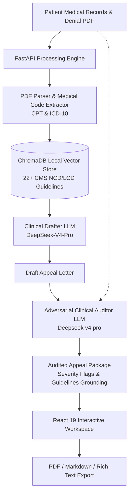

# AppealForge

> **AI-Powered Clinical Appeals System** that automatically reverses health insurance medical denials through RAG-augmented clinical guideline retrieval, verified medical drafting, and independent LLM fact-checking audit.

---

## Overview

Over **60% of legitimate healthcare insurance denials** go unappealed due to administrative friction, complex medical coding, and aggressive insurer review processes. **AppealForge** bridges this gap by transforming insurance denial letters into rigorous, legally sound, and clinically substantiated appeal packages in seconds.



### Key Capabilities

1. **Intelligent Document Ingestion**: Parses denial letters and clinical records from PDF format, extracting rejection rationale and clinical codes (CPT, ICD-10) with contextual ontologies.
2. **RAG-Augmented Coverage Grounding**: Retrieves authoritative National and Local Coverage Determinations (**CMS NCD / LCD**) to substantiate medical necessity.
3. **Dual-Model Architecture (Drafting + Clinical Audit)**:
   - **Lead Drafter (`DeepSeek-V4-Pro`)**: Formats an authoritative legal appeal tailored to insurer standards.
   - **Clinical Auditor (`Qwen/Qwen2.5-32B-Instruct`)**: Cross-examines every fact, conservative therapy duration, and symptom in the draft against raw medical records to eliminate hallucinations.
4. **Interactive Flagging & Verification**: Visualizes unbacked claims directly in the UI with severity metrics and source-tethered explanations.
5. **Multi-Format Export & Local Fallback**: Generates submission-ready Markdown and PDF appeal letters, with built-in mock fallback for offline resilience.

---

## Technical Writeup & Architecture

### 1. What Problem We Are Solving

Over 60% of legitimate healthcare insurance denials go unappealed due to administrative friction, complex medical coding, and aggressive insurer review processes. AppealForge bridges this gap by transforming insurance denial letters into rigorous, legally sound, and clinically substantiated appeal packages in seconds.

### 2. The Tech Stack

<aside>
🛠

- **Frontend**: React 19, TypeScript, Vite, Tailwind CSS, IBM Plex Sans & Mono, Fraunces.
- **Backend & Data Pipeline**: FastAPI, Pydantic v2, Uvicorn, Python 3.11+, and PyMuPDF.
- **Clinical RAG**: ChromaDB persistent local vector embeddings with 22+ CMS Coverage Determinations (NCD/LCD).
- **AI / LLM Infrastructure**: Hosted via Featherless AI, utilizing a Dual-Model Architecture:
    - *Lead Drafter*: DeepSeek-V4-Pro (formats authoritative legal appeals).
    - *Clinical Auditor*: Qwen 2.5 32B (cross-examines facts against raw medical records).
</aside>

### 3. What Was Hard

- **Mitigating Clinical Hallucinations:** We engineered a Dual-Model Architecture where DeepSeek-V4-Pro drafts the appeal, but Qwen 2.5 32B acts as an adversarial auditor—cross-examining every extracted symptom and conservative therapy duration against the raw patient records.
- **Deterministic RAG Grounding:** We integrated ChromaDB as a local vector store containing 22+ CMS NCD/LCD guidelines. Ensuring the AI cited authoritative National and Local Coverage Determinations required meticulous tuning of our FastAPI retrieval pipeline.
- **HIPAA-Conscious Architecture & Privacy:** Handling medical records required a zero remote storage approach. All document ingestion and RAG searches are performed in-memory or via local vector storage. No credentials, patient data, or documents are persisted to external databases.
- **Interactive Verification:** We built an interactive React 19 workspace that visualizes unbacked claims with severity metrics and source-tethered explanations, providing multi-format export (Markdown/PDF) and a mock fallback for offline resilience.

---

## Quickstart Guide

### Option A: Automated One-Click Start (Recommended)

```bash
chmod +x start.sh
./start.sh
```

### Option B: Run with Docker Compose

```bash
docker compose up -d --build
```

- **Web App**: `http://localhost:5173`
- **Backend API Docs**: `http://localhost:8000/docs`
- **Health Check**: `http://localhost:8000/health`

> **Note on Initial Setup & API Key Security**:
> When opening the web app for the first time, an interactive configuration modal will prompt for your **Featherless API Key**. 
> - **Privacy & Local Storage**: Your API key is stored strictly on your local machine (`.env` volume). It is **never** uploaded to any external database, cloud telemetry, or third-party service.
> - **No Manual File Edits**: The web UI saves credentials atomically without restarting containers.

To stop the containers:
```bash
docker compose down
```

---

### Option C: Run Locally (Without Docker)

#### Prerequisites
- **Python 3.11+**
- **Node.js 18+** / npm
- **Featherless AI API Key** (optional for mock demonstration mode)

#### 1. Backend Setup

```bash
# Navigate to backend
cd backend

# Create & activate virtual environment
python3 -m venv .venv
source .venv/bin/activate

# Install dependencies
pip install -r requirements.txt

# Run automated tests
PYTHONPATH=. python3 -m unittest discover -s tests

# Start backend server
uvicorn app.main:app --reload --port 8000
```

#### 2. Frontend Setup

```bash
# Navigate to frontend
cd frontend

# Install packages
npm install

# Run build & verification
npm run build

# Launch Vite development server
npm run dev
```

- Web Interface: `http://localhost:5173`

---

## Automated Verification & Testing

Both backend and frontend contain automated test suites:

- **Backend Tests (Unit & API)**:
  ```bash
  PYTHONPATH=backend backend/.venv/bin/python3 -m unittest discover -s backend/tests
  ```
- **Frontend E2E & Production Build**:
  ```bash
  cd frontend && npm run build
  ```

---

## Security & Data Privacy

- **Local-First Configuration**: All API keys and environment variables reside exclusively in your local environment.
- **Zero Remote Storage**: No credentials, patient data, or documents are persisted to external databases.
- **HIPAA-Conscious Architecture**: Ingestion and RAG search are performed in memory and local vector storage.

---

## Tech Stack

| Layer | Technologies |
|---|---|
| **Frontend** | React 19, TypeScript, Vite, Tailwind CSS, IBM Plex Sans & Mono, Fraunces |
| **Backend** | FastAPI, Pydantic v2, Uvicorn, Python 3.11+, PyMuPDF |
| **AI / LLMs** | DeepSeek-V4-Pro (Drafter), Qwen 2.5 32B (Auditor), Featherless AI |
| **Clinical RAG** | ChromaDB, Persistent Vector Embeddings, CMS Coverage Determinations (NCD/LCD) |
| **Testing & CI** | Python Unittest / TestClient, TypeScript strict check, Vite bundle audit |

---

## Team & Hackathon

Built with pride for **Impact Forge Hackathon 2026**.

## License

This project is licensed under the MIT License with a Clinical AI Disclaimer - see the [LICENSE](LICENSE) file for details.
